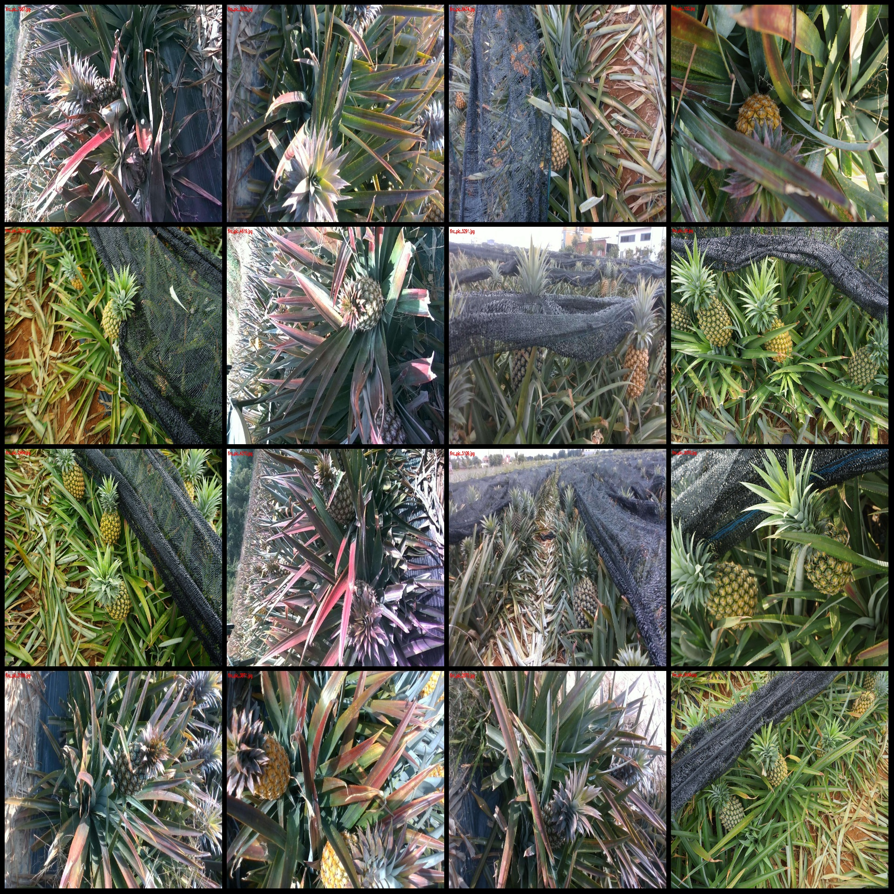
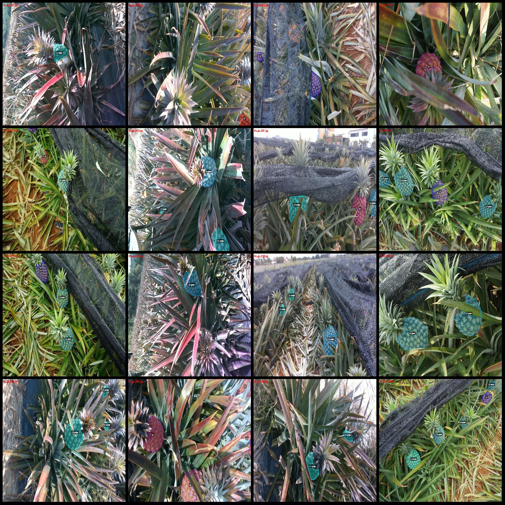
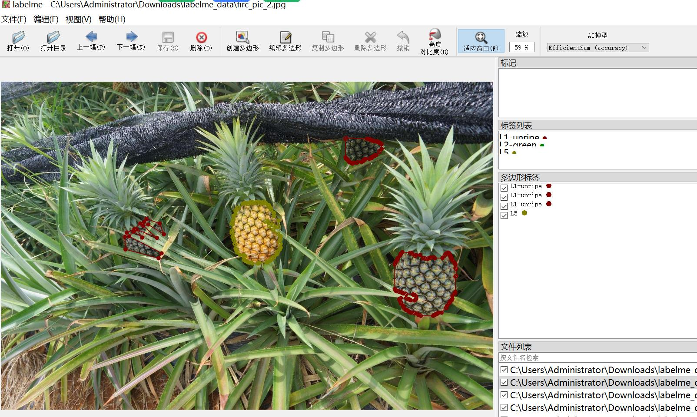

# Smart Orchard Actual Shot High Definition Pineapple Maturity Identification and Segmentation Data Set (labelme format) - 7808 Images of 5 Categories

Dataset format: labelme format (excluding mask files, only containing jpg images and corresponding json files).
Number of images (number of jpg files): 7808.
Number of annotations (json file count): 7808.
Number of annotation categories: 5.
Annotation category names: ["L1-unripe", "L2-green", "L3", "L4", "L5"].
Number of boxes per category:
L1-unripe (unripe pineapples): 6662
L2-green (green pineapples): 4561
L3 count (three-level ripe pineapples): 912
L4 count (four-level ripe pineapples): 2471
L5 count (five-level ripe pineapples): 4286
Total box count: 18892.
Annotation tool used: labelme v5.5.0.
Image resolution: Multiple resolution images, such as 1920x1080, 1920x1276, etc.
Annotation rules: Polygons are drawn around the categories.
Important note: The dataset can be edited using labelme, but the json dataset needs to be converted into either mask or yolo format for instance segmentation or semantic segmentation.
Special declaration: This dataset does not guarantee the precision of the models trained or the weight files.
Image preview:
Annotation example:
Randomly selected 16 images for annotation:
Annotation drawing result:
Labelme editing image example:

## Picture

Here is a pay link on Stripe ( https://buy.stripe.com/3cs8yP7sY87d0vu9AB ). Please contact me lonlonago@foxmail.com after funding $89, and I will send you a complete data files , thank you!

